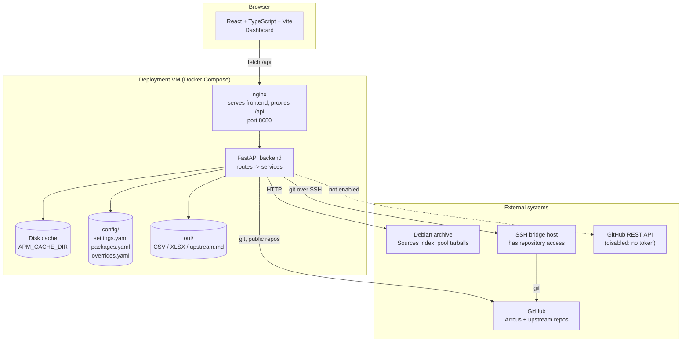
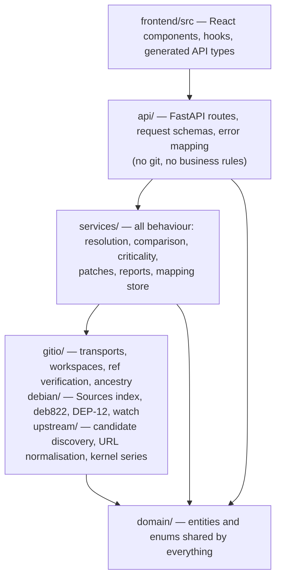
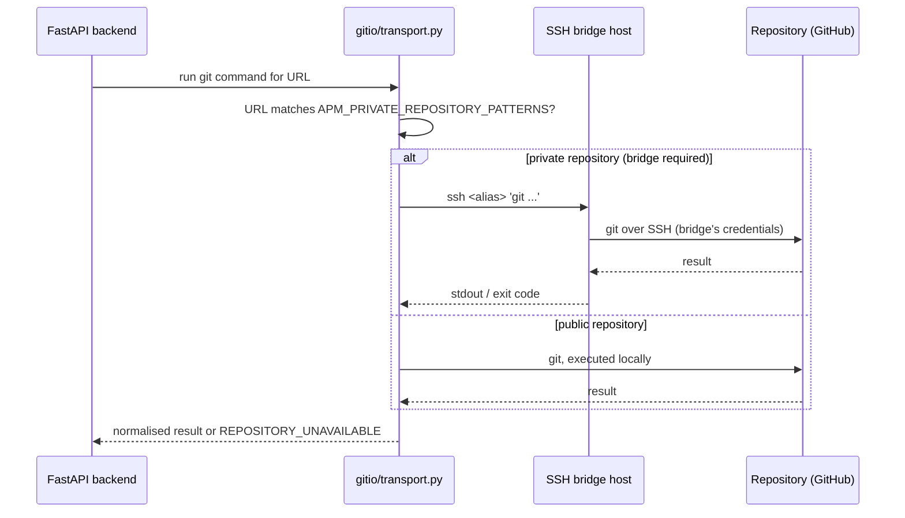
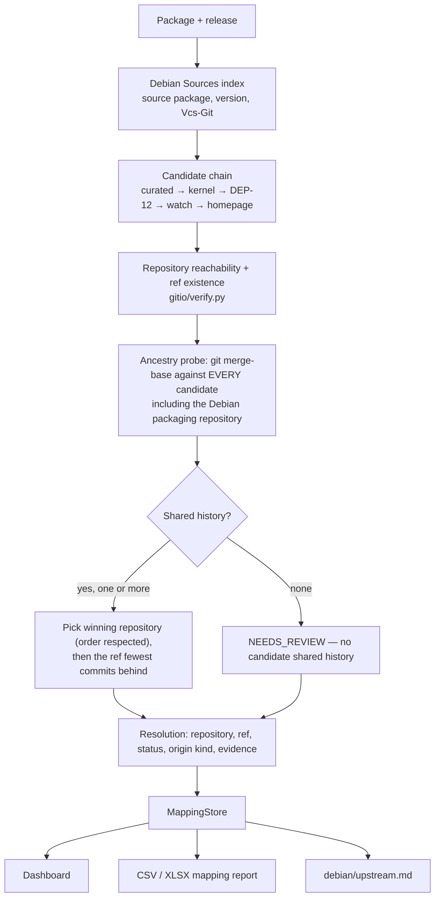
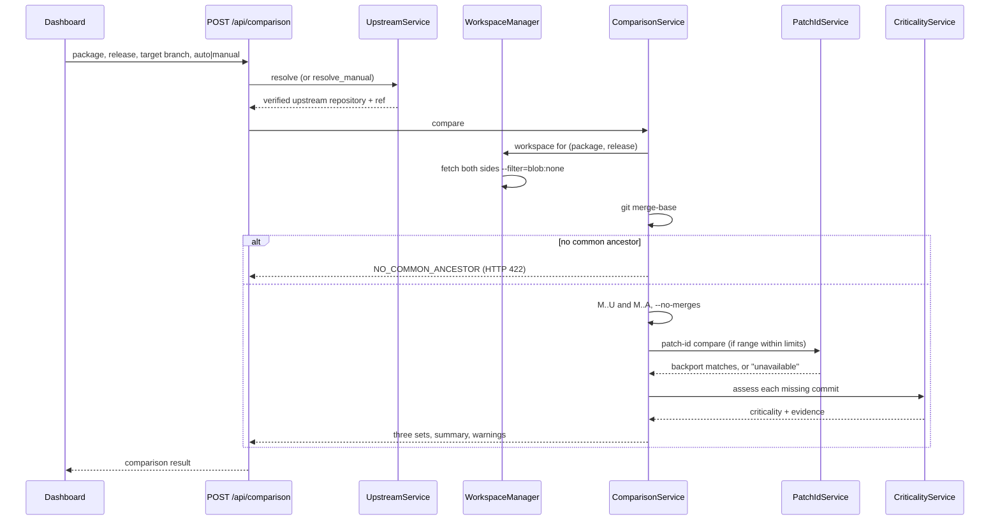
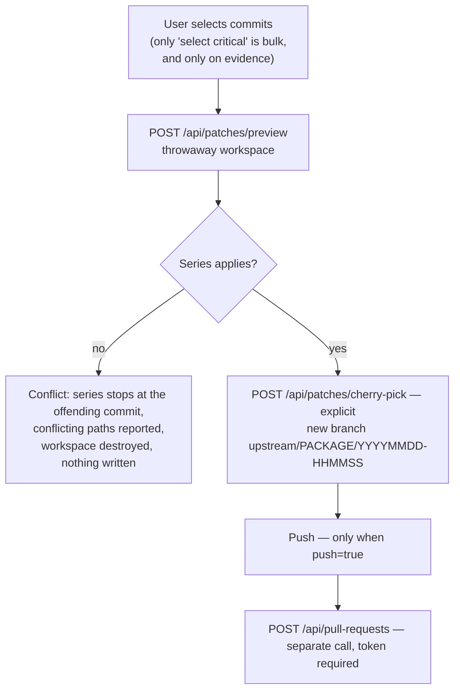
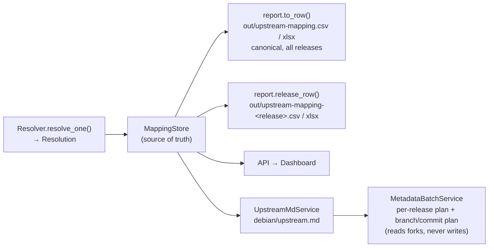

# ARCoS Package Manager — Architecture, Design and Internship Milestones

**Author:** Somil Rathore
**Project repository:** `arcos-package-manager`
**Document status:** Draft for mentor review
**Last updated:** TBD

> **Rendering note:** this page uses Mermaid diagrams. In Confluence, paste each
> diagram body into a *Mermaid Diagram* macro (or a code block with language
> `mermaid` if the Markdown macro is enabled).

---

## 1. Problem statement

ARCoS ships a large set of Debian-derived packages, each maintained as an Arrcus
fork of some upstream. Over time those forks drift, and three questions become
hard to answer with confidence:

1. **How far behind is this package?** Not "what version does it claim", but how
   many real upstream commits are absent from the ARCoS branch.
2. **Which of the missing commits actually matter?** Security fixes and stable
   backports must be distinguishable from routine churn.
3. **How do we safely pull selected patches in?** Without corrupting a target
   branch, without silently resolving a conflict, and without applying a patch
   that is already there under a different SHA.

The ARCoS Package Manager answers all three from evidence — Debian archive
metadata and the git commit graph — rather than from version strings or
guesswork.

### Scope of the current system

| In scope today | Not in scope today |
|---|---|
| Package discovery from the release manifest | Automatic push to any branch |
| Upstream repository and ref resolution, with proof | Automatic pull request creation |
| Git comparison and commit classification | Automatic conflict resolution |
| Evidence-based criticality detection | Building or testing the packages themselves |
| Safe cherry-pick preview in a throwaway workspace | Release decision-making |
| Excel/CSV mapping reports and `debian/upstream.md` generation | |

The deployment on the VM is currently **read-only**: no GitHub token is
configured, so every write path (push, PR) is intentionally disabled and the
dashboard reports this rather than failing at the last step.

---

## 2. High-level architecture

The system is a single-origin web application: a React frontend served by nginx,
which proxies `/api` to a FastAPI backend. The backend performs Debian metadata
lookups over HTTP and runs git either locally or through an SSH bridge host that
has access to the private Arrcus repositories.

There is **no database**. All durable state is either generated configuration,
an on-disk cache, a git workspace, or a report file.



### Layering



The rule that holds this together: **routes contain no logic**. Each route
resolves its dependencies, calls exactly one service, and returns a domain
model. The CLI, the API and the report writer all build the same object graph
from `services/container.py`, so there is no second place where behaviour is
wired up slightly differently — and the CLI and the dashboard cannot produce
different answers for the same package.

---

## 3. Backend component responsibilities

### 3.1 API layer (`src/apm/api/`)

| Module | Responsibility |
|---|---|
| `main.py` | Application assembly, router registration, OpenAPI schema |
| `routes/catalog.py` | Releases, packages, real branches of a fork |
| `routes/upstream.py` | Auto resolution, manual verification, resolution evidence |
| `routes/comparison.py` | Git comparison, commit lists |
| `routes/patches.py` | Preview, cherry-pick |
| `routes/upstream_md.py` | `debian/upstream.md` rendering and PR proposal |
| `routes/reports.py` | Download generated mapping workbooks and CSVs |
| `routes/health.py` | Readiness, and what this deployment is permitted to do |
| `errors.py` | Domain errors → HTTP status + stable error codes |
| `deps.py` | Dependency wiring into the service container |

Public API surface (all under `/api`; full schema at `/docs`):

| Method | Path | Purpose |
|---|---|---|
| GET | `/health`, `/health/workspace` | Readiness and capability reporting |
| GET | `/releases` | Debian releases the tool resolves against |
| GET | `/packages`, `/packages/{package}` | Catalogue, filterable by release |
| GET | `/branches` | Real branches of a package's fork |
| GET | `/upstream/{package}` | Resolve upstream (auto) |
| POST | `/upstream/resolve` | Resolve upstream (auto) with options |
| POST | `/upstream/verify` | Resolve from user input — still verified |
| GET | `/upstream/{package}/evidence` | Why that upstream was chosen |
| POST/GET | `/comparison`, `/comparison/{package}` | Git comparison |
| GET | `/commits/{package}` | Commit lists alone |
| POST | `/patches/preview` | Safe preview; writes nothing |
| POST | `/patches/cherry-pick` | New branch; pushes only if asked |
| POST/GET | `/pull-requests`, `/pull-requests/{number}` | Pull requests (token-gated) |
| POST | `/upstream-md/generate` | Render `debian/upstream.md` |
| POST | `/upstream-md/pr` | Propose it; requires `confirm: true` |
| GET | `/reports`, `/reports/{name}` | Generated mapping reports |

### 3.2 Service layer (`src/apm/services/`)

| Service | Responsibility |
|---|---|
| `catalog_service.py` | Package catalogue and branch listing for a release |
| `upstream_service.py` | Auto and manual upstream resolution; the only entry point to the resolution pipeline |
| `mapping_store.py` | **Source of truth for verified mappings.** Serves stored resolutions; live resolution runs only on explicit refresh |
| `comparison_service.py` | Merge-base, the three commit sets, warnings, truncation |
| `patch_id_service.py` | `git patch-id --stable` computation and matching for backport detection |
| `criticality_service.py` | Evidence-based criticality assessment per commit |
| `patch_service.py` | Preview in a throwaway workspace; cherry-pick onto a new branch |
| `github_service.py` | GitHub REST access (PR creation/lookup) — token-gated, disabled in the current deployment |
| `upstream_md_service.py` | Deterministic `debian/upstream.md` rendering and diffing |
| `metadata_batch_service.py` | Drives `upstream.md` generation across a whole release; read-only against remotes |
| `adapters.py` | Pipeline objects → domain models |
| `container.py` | Single composition root for CLI, API and reports |

### 3.3 Git I/O layer (`src/apm/gitio/`)

| Module | Responsibility |
|---|---|
| `transport.py` | One decision: does this URL need the SSH bridge? Made from configuration; no host name appears in application code |
| `workspaces.py` / `workspace.py` | Persistent per-(package, release) clones and throwaway worktrees; blobless fetch, blob backfill |
| `verify.py` | Repository reachability and ref existence checks |
| `ancestry.py` | `git merge-base` probing of candidate upstreams |

### 3.4 Debian and upstream layers

| Module | Responsibility |
|---|---|
| `debian/sources_index.py` | Archive `Sources` index; `-updates` and `-security` merged over the base suite exactly as apt would |
| `debian/deb822.py` | deb822 stanza parsing |
| `debian/dep12.py` | DEP-12 `debian/upstream/metadata` |
| `upstream/strategies.py` | The ordered candidate chain |
| `upstream/forge.py` | URL normalisation into real forge repositories |
| `upstream/kernel.py` | Debian kernel version → `linux-X.Y.y` series |
| `discovery/gitmodules.py`, `discovery/catalog.py` | Package discovery from the release manifest |
| `report.py` | CSV and XLSX writers |

---

## 4. Frontend responsibilities

React + TypeScript + Vite, built as static assets and served by nginx. The
frontend renders state and collects intent; it contains no resolution,
comparison or criticality logic.

| Component | Responsibility |
|---|---|
| `pages/DashboardPage.tsx` | Page composition and workflow state |
| `components/SelectionPanel.tsx` | Release, package, target branch, auto vs manual resolution |
| `components/ResolutionCard.tsx` | Resolved upstream repository/ref, status, origin kind, evidence |
| `components/CommitTable.tsx` | The three commit sets, criticality badges, commit selection |
| `components/PreviewPanel.tsx` | Cherry-pick preview results and conflict reporting |
| `components/UpstreamMdPanel.tsx` | `debian/upstream.md` rendering and its diff status |
| `components/DownloadMappingReport.tsx` | Access to generated CSV/XLSX reports |
| `components/ErrorAlert.tsx` | Backend error codes rendered as explanations, not stack traces |
| `services/api.ts`, `hooks/useApi.ts` | Typed HTTP client and request state |
| `types/api.ts` | **Generated** from the backend OpenAPI schema |

`scripts/generate_frontend_types.py` emits `types/api.ts` from the schema
FastAPI serves. A field added to a domain model reaches the frontend's types on
the next regeneration, and a mismatch becomes a TypeScript compile error rather
than an `undefined` at runtime.

Because only the frontend container publishes a port and the backend is reached
through it, there is one origin and no CORS configuration to maintain.

---

## 5. Git access and the SSH bridge

The machine running the tool does not need GitHub access; it needs a route to a
machine that has it.



`APM_GIT_BACKEND` selects the policy: `auto` (private repos over SSH, everything
else local — right for a laptop), `local` (this host already has access), or
`ssh` (everything on the bridge). Which repositories need the bridge is a
configurable list of regular expressions; **no host name, user or organisation
appears in application code**.

`APM_WORKSPACE_DIR` is a path *on the host git actually runs on* — with the
`ssh` backend that is the bridge, not the application VM. `/api/health/workspace`
reports whether it is present and writable, so a misconfiguration is visible
before the first comparison rather than during it.

---

## 6. Upstream resolution flow

### 6.1 The problem being solved

Debian does not record a package's upstream in one reliable field, and ARCoS
forks are not all forks of the same kind of thing. Some track the upstream
project; others track the **Debian packaging repository**; a few were imported
from tarballs and share history with nothing. A confident but wrong upstream
produces a diff that looks authoritative and means nothing — so the mapping is
measured, not guessed.

### 6.2 The candidate chain

Ordered; first hit wins; every step records why it fired.

| Method | Source | Confidence |
|---|---|---|
| `curated` | `config/overrides.yaml` (hand-verified) | as declared |
| `kernel_series` | Debian kernel version → `linux-X.Y.y` | high |
| `dep12` | `debian/upstream/metadata` `Repository:` | high |
| `watch_forge` | `debian/watch`, only when it names a git forge | medium |
| `homepage_forge` | `Homepage:` normalised to a forge repository | medium |

`Vcs-Git` is deliberately **never** treated as upstream by the chain — it is the
Debian *packaging* repository, and it is carried in its own column instead. A
URL only becomes a repository when the conversion is justified: a project
homepage that names an organisation but not a repository is refused rather than
guessed at.

### 6.3 Ancestry decides



**Origin kind** records whether the fork descends from the project's own
repository or from Debian's packaging repository, because that changes what
pulling a patch actually means.

**Status** is reported honestly and separately from category:

| Status | Meaning |
|---|---|
| `VERIFIED` | Upstream contacted, ref resolved, history shared where probed |
| `PARTIAL` | Resolved, but not fully confirmed |
| `NEEDS_REVIEW` | Exists, but the ref was inferred or no candidate shared history |
| `NO_UPSTREAM` | Searched, and there is provably nothing to track |
| `FAILED` | Resolution errored |

**Category** answers a different question — what kind of package this is:
`debian_upstream`, `debian_no_upstream`, `third_party`, `arrcus_native`,
`vendor`. A vendor blob with no upstream is a finished answer, not a failure;
collapsing the two into one column hides the genuinely unresolved packages among
the ones that never had an upstream to find.

### 6.4 Manual resolution

Manual does not mean unchecked. A user-supplied repository and ref go through
the same verification path: the repository must be reachable, the ref must
exist, and the ancestry check still runs. Auto and manual remain separate code
paths so that a manual override can never silently become the automatic answer
for everyone else.

---

## 7. Comparison flow

### 7.1 The commit graph is the source of truth

A Debian version string says what the packaging claims; it does not say what the
branch contains, and two forks at the same version can differ by hundreds of
commits. Every number reported comes from the commit graph.

Given merge base `M`, upstream head `U` and ARCoS head `A`:

```
missing upstream    M..U, minus anything already present by patch-id
ARCoS-specific      M..A, minus the backports it already carries
already backported  present on both sides under different SHAs
```

Worked example — upstream `A→B→C→D→E`, ARCoS `A→B→C→X→Y`:

| Set | Commits |
|---|---|
| merge base | `C` |
| missing upstream | `D`, `E` |
| ARCoS-specific | `X`, `Y` |

Counting `X` and `Y` as missing upstream commits would report work already done
as a backlog still to do — the single most misleading thing the tool could say.

Merges are excluded throughout (`--no-merges`): a merge commit cannot be
cherry-picked, so counting it would report a backlog larger than the set of
patches the tool can actually offer. The ancestry probe used by the mapping uses
the same basis, so "behind" means the same thing in both places.



### 7.2 No common ancestor

Some ARCoS packages were imported from tarballs rather than forked and share no
commit with any candidate upstream. The comparison **refuses** rather than
inventing a number: the API returns `NO_COMMON_ANCESTOR` (HTTP 422) with an
explanation. A backlog computed against a tree with no shared history is not a
smaller truth, it is a fiction.

### 7.3 Backport detection

A backport is the same change committed again — cherry-picked, rebased or
applied by hand — so its SHA is necessarily different. Comparing SHAs reports it
as missing and invites someone to apply it twice.

`git patch-id --stable` hashes the diff, ignoring commit metadata, context line
numbers and whitespace-only churn, so the same change hashes the same however it
arrived. Subject-line matching is deliberately **not** used: it breaks on
reworded backports and produces false matches between unrelated commits that
share a subject.

Backport detection either runs or reports that it could not. A search that
failed is never reported as a search that found nothing.

### 7.4 Fetch strategy and cost

Both sides are fetched blobless (`--filter=blob:none`) because walking the
commit graph needs no file contents. `patch-id` is the opposite — it
materialises every diff, and in a partial clone each diff triggers a lazy fetch
back to the server. Blobs are therefore backfilled in a single pass, and only
when the range is small enough for backport detection to be worth running
(`max_total_commits`, default 5000). Beyond that, the comparison skips both the
download and the diffing and reports backport detection as unavailable.

Workspaces are keyed by package and release and reused, so the expensive part is
paid once. Timings measured during development and recorded in
[`docs/git-comparison.md`](git-comparison.md):

| Package | Cold | Warm |
|---|---|---|
| `pyrad` (109 + 19 commits) | ~13s | ~12s |
| `iputils` (142 + 272) | ~15s | ~12s |
| `linux` (24,158 + 97) | ~574s | ~11s |

Commit lists are capped (500 by default); when the cap applies, the summary
still reports the true total and a warning says what was shown.

---

## 8. Criticality detection

Criticality is assigned from evidence carried in the commit itself, never from
how the subject line reads.

| Level | Required evidence |
|---|---|
| `CRITICAL` | A CVE identifier or a named security advisory |
| `STABLE_RELEVANT` | A `Cc: stable` trailer |
| `NORMAL` | A `Fixes:` trailer |
| `UNKNOWN` | Anything else |

`UNKNOWN` is not a synonym for safe — it means the tool has insufficient
evidence and is saying so. A commit is never called critical because its subject
sounds alarming, and it is never called safe because it does not.

---

## 9. Patch preview and application flow

Four steps, each an explicit act. Nothing advances on its own.



**Preview** runs the series in a throwaway workspace that is destroyed
afterwards. Nothing is pushed and the target branch is never touched, so a
preview is safe to run against anything. It reports the apply order, which
commits applied, the files that would change, and any conflict.

Commits are applied **oldest first, in topological order**. Topological rather
than by commit date: commits made in the same second sort arbitrarily by date,
which silently reverses a pair of patches and manufactures a conflict the series
does not actually contain.

**Conflicts** stop the series at the offending commit, report the conflicting
paths, and abort. They are never resolved automatically — choosing a side of a
conflict is a product decision, and guessing it silently is how wrong code
ships. There is no force option.

**Cherry-pick** applies the series to a *new* branch created from the target
(`upstream/<package>/<YYYYMMDD-HHMMSS>`). The API refuses a request whose branch
name equals the base, so the target branch is never written to. Commits are
applied with `git cherry-pick -x`, so each records the upstream SHA it came
from. Pushing happens only when `push: true` is passed, and a conflicting series
pushes nothing.

Commits that are already present cannot be selected at all: an ARCoS-specific
commit is already there, and a backported one is already applied.

---

## 10. Data and reporting flow

There is exactly one resolution per `(package, release)`. Everything else is a
rendering of it, which is why the workbook, the dashboard and the committed
`debian/upstream.md` cannot disagree.



### Where state lives

| What | Where | Generated? |
|---|---|---|
| Static configuration | `config/settings.yaml` | no |
| Curated mappings | `config/overrides.yaml` | no — hand-verified, always wins |
| Package catalogue | `config/packages.yaml` | **yes**, by `apm discover` |
| Debian indices, pool tarballs | `$APM_CACHE_DIR/http` | cache |
| Ancestry probe results | `$APM_CACHE_DIR/ancestry` | cache |
| Git workspaces | `$APM_WORKSPACE_DIR` (on the git host) | cache |
| Mapping reports | `out/upstream-mapping*.{csv,xlsx}` | yes |
| `debian/upstream.md` + plan | `out/upstream-md/`, `out/upstream-md-plan-<release>.{json,md}` | yes |

Resolutions are cached in memory for 15 minutes; comparisons are recomputed, but
the workspace is reused, which takes a repeat comparison from minutes to
seconds. No database is used, and none is needed: every durable artefact is
either configuration, a cache that can be deleted, or a report that can be
regenerated.

### `debian/upstream.md`

Generated from the same verified resolution the dashboard shows, and
deterministic, so it can be compared against what is already in the repository
and classified as `CREATED`, `UPDATED`, `NO_CHANGE` or `CONFLICT`. **A file this
tool did not write is never overwritten.**

---

## 11. Security and read-only boundaries

### Current deployment posture

The application is deployed on the project VM under Docker Compose, with the
frontend published on port **8080** and the backend reachable only through it.
`APM_GITHUB_TOKEN` is intentionally left empty, which makes the deployment
read-only: the mapping, comparison, workbook, preview and `upstream.md`
workflows all work without it, and the dashboard reports *"Read-only mode,
GitHub write operations disabled"* rather than failing at the last step.

### Boundaries enforced by construction

| Boundary | How it is enforced |
|---|---|
| Target branch is never modified | Cherry-pick always creates a new branch; the API refuses a request whose branch equals the base |
| Preview writes nothing | Runs in a throwaway workspace, destroyed afterwards |
| Nothing is pushed implicitly | Push requires `push: true`; PR creation is a separate call requiring a token |
| `upstream.md` PRs require intent | `/upstream-md/pr` requires `confirm: true` |
| Existing `upstream.md` is respected | A file the tool did not write is never overwritten |
| No conflict is auto-resolved | The series aborts; there is no force option |
| No commit is called critical without evidence | Criticality requires a CVE, advisory, `Cc: stable` or `Fixes:` |
| Secrets stay out of source | All configuration is environment-driven; `.env` is gitignored; tokens and passwords are never logged |
| Infrastructure stays out of code | No host name, user or organisation is hard-coded; the bridge is described entirely by configuration |

### Credential handling

- Repository read access is provided by the **bridge host's** SSH credentials; the application VM holds no GitHub credentials for reading.
- Keys mounted into containers are mounted read-only, with `APM_UID` matched to the key owner.
- Host key checking defaults to `accept-new` for first connection and should be tightened to `yes` once the host key is pinned in `known_hosts`.
- `APM_SSH_PASSWORD` exists only for hosts that permit nothing better; key-based authentication is the expected configuration.

---

## 12. Important design decisions

| # | Decision | Why |
|---|---|---|
| D1 | **Ancestry, not metadata, decides the upstream** | ARCoS forked the Debian *packaging* repository for some packages and the project's own repository for others, and nothing in the metadata distinguishes them. `git merge-base` against every candidate measures it instead of guessing. |
| D2 | **`Vcs-Git` is never treated as upstream** | It is the Debian packaging repository. Treating it as upstream would silently produce the wrong comparison for every package that tracks the project directly. |
| D3 | **Version strings are never used to measure lag** | A version says what the packaging claims, not what the branch contains. Two forks at the same version can differ by hundreds of commits. |
| D4 | **ARCoS-specific commits are a separate set** | Counting local work as missing upstream work reports finished work as backlog — the most misleading possible output. |
| D5 | **Backports detected by `patch-id --stable`, not subject line** | A backport necessarily has a different SHA; subject matching breaks on rewording and produces false matches between unrelated commits. |
| D6 | **Criticality requires evidence; `UNKNOWN` is a real answer** | A commit called critical on a hunch teaches reviewers to distrust the tool; `UNKNOWN` is honest rather than falsely reassuring. |
| D7 | **The comparison refuses when there is no common ancestor** | Some packages were imported from tarballs. A number computed across unrelated histories is a fiction, not an approximation. |
| D8 | **`MappingStore` is the single source of truth** | The workbook, the dashboard and the committed `upstream.md` are renderings of one resolution, so they cannot disagree. A second hand-maintained mapping is exactly what this structure prevents. |
| D9 | **Expensive live resolution only on explicit request** | Full resolution contacts remotes and probes ancestry. Running it on every page load would make the dashboard unusable and hammer the bridge. |
| D10 | **Auto and manual resolution stay separate — but manual is still verified** | A manual override must never silently become the automatic answer, and an unverified manual mapping would reintroduce exactly the guessing the design removes. |
| D11 | **Preview runs in a throwaway workspace** | A preview that could touch a real branch is not a preview. Destroying the workspace makes the safety property structural rather than procedural. |
| D12 | **No automatic push or PR creation** | Every write is an explicit human act. The read-only default means a misconfiguration cannot escalate into an unintended repository change. |
| D13 | **Git access is a transport, not a dependency** | The machine running the tool may not be the machine with repository access. One configurable decision — does this URL need the bridge? — keeps every layer above it host-agnostic. |
| D14 | **No database** | All state is generated configuration, a deletable cache, a git workspace or a regenerable report. A database would add a second source of truth and an operational burden for no gain. |
| D15 | **Frontend types generated from the OpenAPI schema** | A domain model change becomes a TypeScript compile error rather than an `undefined` at runtime. |
| D16 | **Blobless fetch, with blobs backfilled only when needed** | Graph walking needs no file contents; `patch-id` needs all of them. Lazy per-diff fetching in a partial clone was measured stalling for minutes, so the cost is paid deliberately in one pass or skipped and reported. |
| D17 | **Package list read from the release manifest at runtime** | `.gitmodules` on the release branch *is* the package list, and it differs per Debian release. Hard-coding it, or reading one manifest for both releases, invents packages that do not ship. |
| D18 | **The pinned submodule commit outranks the manifest's `branch =` line** | That field goes stale; what ships is the commit the superproject pins. Trusting the stale field pairs a fork against the wrong upstream series and reports a meaningless backlog. |
| D19 | **Integration tests build real git repositories** | A mocked git would happily confirm whatever the code already believes. GitHub itself is always mocked — no test opens a pull request. |

---

## 13. Milestones and goals

Status values: **Completed** · **In Progress** · **Planned**.
Dates are TBD pending agreement with the mentor.

### 13.1 Minimum / committed goals

These are the goals the internship commits to delivering.

---

#### M1 — Bookworm + `aminor` package mapping, complete and stable

| Field | Detail |
|---|---|
| **Goal** | Produce a complete, reproducible upstream mapping for every package ARCoS ships in Bookworm on the `aminor` branch. |
| **Deliverable** | `apm discover` → `config/packages.yaml`; `apm.resolve_bookworm` → `out/upstream-mapping-bookworm.{csv,xlsx}` plus the canonical all-release CSV. |
| **Acceptance criteria** | Package set read from the release manifest at runtime, not hard-coded; every package carries a status, category and origin kind; no package is silently dropped, including the top-level submodules such as `linux`; the run is reproducible from a clean cache. |
| **Dependencies** | Access to `Arrcus/arrcus_rel` via the SSH bridge; Debian archive reachability. |
| **Status** | **In Progress** — pipeline runs end to end; remaining `NEEDS_REVIEW` packages are being driven to a final answer (`VERIFIED` or `NO_UPSTREAM`) via `config/overrides.yaml`. |

---

#### M2 — Verified upstream repository and branch resolution

| Field | Detail |
|---|---|
| **Goal** | Resolve each package's real upstream repository and ref, and prove the mapping rather than asserting it. |
| **Deliverable** | Ordered candidate chain (`curated → kernel_series → dep12 → watch_forge → homepage_forge`), reachability and ref verification, `merge-base` ancestry probing, and a per-package evidence record exposed at `GET /upstream/{package}/evidence`. |
| **Acceptance criteria** | Every reported upstream was contacted and its ref resolved; `Vcs-Git` is never returned as upstream by the chain; packages whose fork descends from the Debian packaging repository are identified as such via origin kind; a package with no shared history is reported `NEEDS_REVIEW`, never given a plausible-looking answer; manual resolution goes through identical verification. |
| **Dependencies** | M1; SSH bridge; Debian metadata layer. |
| **Status** | **Completed** |

---

#### M3 — Reliable git comparison

| Field | Detail |
|---|---|
| **Goal** | Report how far a package is behind its upstream, from the commit graph alone. |
| **Deliverable** | `ComparisonService`: merge-base, `M..U` / `M..A` ranges with `--no-merges`, workspace reuse, blobless fetch with deliberate blob backfill, timeouts, truncation and explicit warnings. |
| **Acceptance criteria** | No reported number derives from a version string; merges are excluded consistently in both comparison and the ancestry probe; a repeat comparison reuses its workspace; long ranges and applied caps are surfaced as warnings rather than applied silently; a package with no shared history returns `NO_COMMON_ANCESTOR` (HTTP 422) instead of a number. |
| **Dependencies** | M2; writable `APM_WORKSPACE_DIR` on the git host. |
| **Status** | **Completed** |

---

#### M4 — Commit classification: missing / ARCoS-specific / already backported

| Field | Detail |
|---|---|
| **Goal** | Keep the three commit sets strictly apart, so backlog means backlog. |
| **Deliverable** | Three-set classification in `ComparisonService` plus `PatchIdService` backport detection using `git patch-id --stable`. |
| **Acceptance criteria** | An ARCoS-specific commit never appears as missing upstream work; a commit already applied under a different SHA never appears as missing; subject-line matching is not used anywhere; when the range exceeds the configured limit, backport detection reports itself unavailable rather than reporting zero backports. |
| **Dependencies** | M3. |
| **Status** | **Completed** |

---

#### M5 — Evidence-based critical commit detection

| Field | Detail |
|---|---|
| **Goal** | Identify commits that demonstrably matter, and be explicit when the evidence is absent. |
| **Deliverable** | `CriticalityService` producing `CRITICAL` / `STABLE_RELEVANT` / `NORMAL` / `UNKNOWN` with the matched evidence attached to each commit. |
| **Acceptance criteria** | `CRITICAL` requires a CVE or named advisory; `STABLE_RELEVANT` requires `Cc: stable`; `NORMAL` requires a `Fixes:` trailer; everything else is `UNKNOWN`; no classification derives from subject-line wording; the evidence behind each classification is visible in the UI. |
| **Dependencies** | M3. |
| **Status** | **Completed** |

---

#### M6 — Dashboard with selection and comparison

| Field | Detail |
|---|---|
| **Goal** | Give a reviewer the whole picture for one package in one screen, without a terminal. |
| **Deliverable** | React dashboard: release / package / branch / resolution-mode selection, resolution card with evidence, three commit tables with criticality badges, preview panel, `upstream.md` panel, report downloads, typed error surfacing. |
| **Acceptance criteria** | Every backend capability above is reachable from the UI; frontend types are generated from the OpenAPI schema; backend error codes render as explanations; read-only mode is stated in the UI rather than discovered at the point of failure; a long first comparison does not abort in the client before the backend's own timeout. |
| **Dependencies** | M2–M5. |
| **Status** | **Completed** |

---

#### M7 — Excel / CSV mapping report

| Field | Detail |
|---|---|
| **Goal** | A shareable mapping artefact for people who will not run the tool. |
| **Deliverable** | `report.py` writing `out/upstream-mapping.{csv,xlsx}` (canonical, all releases) and `out/upstream-mapping-<release>.{csv,xlsx}`, downloadable from the dashboard via `/api/reports`. |
| **Acceptance criteria** | Rendered from `MappingStore`, so it cannot disagree with the dashboard; source package, Debian version, packaging repository, upstream repository, ref, status, category and origin kind are all present; `scripts/verify_output.py` invariants pass against the generated workbook. |
| **Dependencies** | M1, M2. |
| **Status** | **Completed** |

---

#### M8 — Deterministic `debian/upstream.md` generation

| Field | Detail |
|---|---|
| **Goal** | Put the verified mapping into each package repository in a form that can be reviewed and committed. |
| **Deliverable** | `UpstreamMdService` + `apm.generate_upstream_md` producing `out/upstream-md/<package>/debian/upstream.md` and `out/upstream-md-plan-<release>.{json,md}`. |
| **Acceptance criteria** | Byte-identical output across runs for unchanged input; each file classified `CREATED` / `UPDATED` / `NO_CHANGE` / `CONFLICT` against what the repository already holds; a file the tool did not write is never overwritten; generation contacts no remote for writing. |
| **Dependencies** | M2, M7. |
| **Status** | **Completed** |

---

#### M9 — VM deployment (read-only)

| Field | Detail |
|---|---|
| **Goal** | Make the tool usable by someone other than its author, without local setup. |
| **Deliverable** | Dockerised stack (`Dockerfile`, `frontend/Dockerfile`, `docker-compose.yml`) deployed on the project VM, frontend on port 8080, backend reachable only through it, SSH bridge configured entirely through `.env`. |
| **Acceptance criteria** | `/api/health` and `/api/health/workspace` both report ready; a full package comparison completes from the browser; no GitHub token is configured and the UI states read-only mode; no host name or credential appears in the repository. |
| **Dependencies** | M1–M8; SSH bridge access from the VM. |
| **Status** | **Completed** — deployed and serving; further validation with additional packages continues under M11. |

---

#### M10 — Safe patch preview and conflict detection

| Field | Detail |
|---|---|
| **Goal** | Let a reviewer find out whether a set of patches applies, without risking anything. |
| **Deliverable** | `POST /api/patches/preview` and `PatchService`: throwaway workspace, topological oldest-first ordering, per-commit apply results, changed-file list, conflicting paths. |
| **Acceptance criteria** | The target branch is never touched by a preview; the workspace is destroyed afterwards; conflicts stop the series and report their paths; no automatic conflict resolution and no force option exists; already-present commits cannot be selected; ordering is topological, not by commit date. |
| **Dependencies** | M3, M4. |
| **Status** | **Completed** |

---

#### M11 — Test coverage and documentation

| Field | Detail |
|---|---|
| **Goal** | Make the guarantees above checkable by someone who did not write the code. |
| **Deliverable** | Backend test suite (offline fixture tests plus integration tests that build **real** git repositories), frontend tests that mock `fetch` rather than the API client, `scripts/verify_output.py` invariants, and the `docs/` set: architecture, upstream resolution, git comparison, patch workflow, deployment, and the Bookworm/`aminor` walkthrough. |
| **Acceptance criteria** | Each safety property in §11 has at least one test asserting it; GitHub is mocked in every test and no test opens a pull request; `./scripts/test.sh` passes from a clean checkout; a new engineer can deploy and run the tool from the docs alone. |
| **Dependencies** | M1–M10. |
| **Status** | **In Progress** — 23 backend test modules (~160 tests) and a frontend suite (~27 assertions) exist alongside six documents; remaining work is closing coverage gaps on the newer services and finishing the operational runbook. |

---

### 13.2 Stretch goals

Valuable, scoped, and attempted in this order if the committed goals land early.
None of these is required for the internship to be considered complete.

---

#### S1 — Trixie support

| Field | Detail |
|---|---|
| **Goal** | Produce the same verified mapping and comparison for Trixie that M1–M4 deliver for Bookworm. |
| **Deliverable** | End-to-end Trixie run: `--release trixie` discovery from the `aminor-trixie` manifest branch, resolution, workbook and `upstream.md` plan. |
| **Acceptance criteria** | The Trixie package set is read from its own manifest branch rather than inherited from Bookworm; packages dropped in Trixie do not appear; packages that moved branch are compared against the branch they actually ship on; the pinned submodule commit is preferred over a stale `branch =` field; no Trixie-specific code path is added. |
| **Dependencies** | M1–M4. |
| **Status** | **In Progress** — configuration and the release-generic code paths are in place; the end-to-end run and its review have not been completed. |

---

#### S2 — Improved automatic upstream discovery

| Field | Detail |
|---|---|
| **Goal** | Reduce the number of packages that need a curated override to reach `VERIFIED`. |
| **Deliverable** | Additional evidence sources and stricter URL-to-repository normalisation in the candidate chain. |
| **Acceptance criteria** | Each new source is ordered explicitly in the chain and records its own evidence; the count of `NEEDS_REVIEW` packages falls without any package's status being upgraded on weaker evidence than before; no new source infers a repository from an organisation alone. |
| **Dependencies** | M2. |
| **Status** | **Planned** |

---

#### S3 — Automated `debian/upstream.md` commit workflow

| Field | Detail |
|---|---|
| **Goal** | Turn the generated `upstream.md` plan into reviewable commits without hand-copying files. |
| **Deliverable** | Branch creation and commit of generated `upstream.md` files per package, driven from the existing plan. |
| **Acceptance criteria** | Commits land on a new branch only, never a target branch; a `CONFLICT` classification blocks the commit for that package; the operation requires explicit confirmation; nothing is pushed without a separate act. |
| **Dependencies** | M8; S4. |
| **Status** | **In Progress** — generation, planning and the confirmation-gated `/upstream-md/pr` route exist; the commit step is not enabled in the deployment. |

---

#### S4 — GitHub API integration

| Field | Detail |
|---|---|
| **Goal** | Enable the write-side capabilities that currently sit behind an unset token. |
| **Deliverable** | `GithubService` exercised against the real organisation with a `repo`-scoped, SSO-authorised token, plus capability reporting through `/api/health`. |
| **Acceptance criteria** | Absence of a token degrades to read-only with a clear UI message (already true) and never to a late failure; tokens are never logged; an unauthorised token is reported as `AUTH_REQUIRED` rather than as a missing repository; the token is supplied by environment only. |
| **Dependencies** | M9; approval to issue a token. |
| **Status** | **In Progress** — service and routes are implemented and mocked in tests; intentionally disabled in the current deployment. |

---

#### S5 — Explicit push and pull-request creation workflow

| Field | Detail |
|---|---|
| **Goal** | Complete the four-step patch workflow through to a reviewable pull request. |
| **Deliverable** | `POST /api/patches/cherry-pick` with `push: true` and `POST /api/pull-requests`, with a PR body carrying package, release, target branch, upstream repository and ref, merge base, and every applied commit with its criticality and evidence. |
| **Acceptance criteria** | Push and PR creation remain separate explicit calls; a conflicting series pushes nothing; the branch name can never equal the base; an existing open PR for the branch is returned rather than duplicated. |
| **Dependencies** | M10, S4. |
| **Status** | **In Progress** — implemented and covered by mocked tests; not enabled against live repositories. |

---

#### S6 — Pull-request status tracking

| Field | Detail |
|---|---|
| **Goal** | Show, per package, which upstream patches are already proposed and where those proposals stand. |
| **Deliverable** | PR state surfaced in the dashboard alongside the commit sets. |
| **Acceptance criteria** | State is read from GitHub, never inferred; a package with no PR is displayed as such rather than as an error; the view degrades cleanly to "unavailable" in read-only mode. |
| **Dependencies** | S4, S5. |
| **Status** | **Planned** — single-PR lookup exists; per-package aggregation and UI do not. |

---

#### S7 — Better conflict handling and patch grouping

| Field | Detail |
|---|---|
| **Goal** | Make a conflicting series actionable instead of merely reported. |
| **Deliverable** | Grouping of related commits (for example a fix and its follow-up) and richer conflict context showing the largest prefix of the series that applies cleanly. |
| **Acceptance criteria** | No conflict is ever resolved automatically; grouping is derived from commit evidence such as `Fixes:` trailers, not from heuristics over subject text; the existing no-force guarantee is unchanged. |
| **Dependencies** | M10. |
| **Status** | **Planned** |

---

#### S8 — Scheduled package and upstream checks

| Field | Detail |
|---|---|
| **Goal** | Notice new upstream activity without someone remembering to look. |
| **Deliverable** | A scheduled run refreshing resolutions and comparisons across a release and recording what changed. |
| **Acceptance criteria** | Scheduled runs are read-only; they reuse warm workspaces rather than re-cloning; a run that fails for one package does not abort the release; results are diffable against the previous run. |
| **Dependencies** | M1–M4, M9. |
| **Status** | **Planned** |

---

#### S9 — CI/CD integration

| Field | Detail |
|---|---|
| **Goal** | Run the test suite and output invariants automatically on every change. |
| **Deliverable** | A pipeline running `./scripts/test.sh`, the frontend tests and `scripts/verify_output.py`, plus an image build. |
| **Acceptance criteria** | The pipeline needs no repository credentials and no GitHub token; offline fixture tests and real-git integration tests both run; a failing invariant fails the build. |
| **Dependencies** | M11. |
| **Status** | **Planned** |

---

#### S10 — Additional reporting and analytics

| Field | Detail |
|---|---|
| **Goal** | Answer release-level questions, not just package-level ones. |
| **Deliverable** | Aggregate views: backlog and critical-commit counts per release, resolution-status breakdown, drift over time. |
| **Acceptance criteria** | Every aggregate is derived from `MappingStore` and comparison output, with no separately maintained numbers; packages where backport detection was unavailable are excluded from counts rather than counted as zero. |
| **Dependencies** | M7, S8. |
| **Status** | **Planned** |

---

#### S11 — Production hardening

| Field | Detail |
|---|---|
| **Goal** | Make the deployment suitable for use beyond the project VM. |
| **Deliverable** | Access control, structured logging and metrics, workspace retention and cleanup policy, pinned host keys, documented backup and recovery of generated artefacts. |
| **Acceptance criteria** | `APM_SSH_STRICT_HOST_KEY_CHECKING=yes` with a pinned host key; no secret appears in any log; workspace growth is bounded by policy rather than by disk; a restart loses no durable artefact. |
| **Dependencies** | M9, S9. |
| **Status** | **Planned** |

---

## 14. Risks and open questions

| Item | Impact | Current handling |
|---|---|---|
| Bridge availability | All git operations fail without it | Surfaced as `REPOSITORY_UNAVAILABLE` with a documented one-line `ssh` test |
| Workspace disk growth | The kernel workspace alone is several GB | Documented reclamation; bounded policy deferred to S11 |
| Cold comparison latency on very large packages | First `linux` comparison takes minutes | Warm workspace reuse; `APM_GIT_LONG_TIMEOUT` bounds a stall without cutting off a legitimate first clone |
| Packages with no common ancestor | Cannot produce a backlog at all | Reported explicitly as `NO_COMMON_ANCESTOR`, not approximated |
| GitHub token issuance and SSO authorisation | Blocks S4–S6 entirely | Read-only by default; needs a decision from the mentor |
| Manifest `branch =` staleness | Would pair a fork with the wrong upstream series | Pinned submodule commit is preferred over the field |

**Open questions for the mentor**

1. Should a GitHub token be issued for this project, and against which organisation scope? This gates S4, S5 and S6.
2. Which packages should be prioritised for driving `NEEDS_REVIEW` to a final answer under M1?
3. Is Trixie (S1) expected within the internship, or is Bookworm sufficient?
4. Who are the intended users of the dashboard beyond the immediate team — this determines how much of S11 matters.

---

## 15. Glossary

| Term | Meaning |
|---|---|
| **merge base** | The most recent common ancestor of the ARCoS branch and the upstream ref |
| **missing upstream** | Commits in `M..U` not already present in the fork under any SHA |
| **ARCoS-specific** | Commits in `M..A` that are local work, not upstream patches |
| **already backported** | A change present on both sides under different SHAs, matched by patch-id |
| **patch-id** | A hash of a commit's diff, stable across cherry-pick and rebase |
| **origin kind** | Whether the fork descends from the project's own repository or the Debian packaging repository |
| **status** | How well the upstream mapping is proven (`VERIFIED` … `FAILED`) |
| **category** | What kind of package this is (`debian_upstream`, `vendor`, `arrcus_native`, …) |
| **SSH bridge** | A host with repository access, through which git commands are executed |

---

## 16. Reference documents in the repository

| Document | Contents |
|---|---|
| `README.md` | Overview, quick start, API table, safety properties |
| `docs/architecture.md` | Layers, request paths, where state lives |
| `docs/upstream-resolution.md` | Candidate chain, ancestry, status and category semantics |
| `docs/git-comparison.md` | Three sets, backport detection, fetch strategy, cost |
| `docs/patch-workflow.md` | Selection, preview, conflicts, cherry-pick, pull request |
| `docs/deployment.md` | SSH bridge, workspace, Docker, VM deployment, troubleshooting |
| `docs/bookworm-aminor-workflow.md` | One release end to end |
