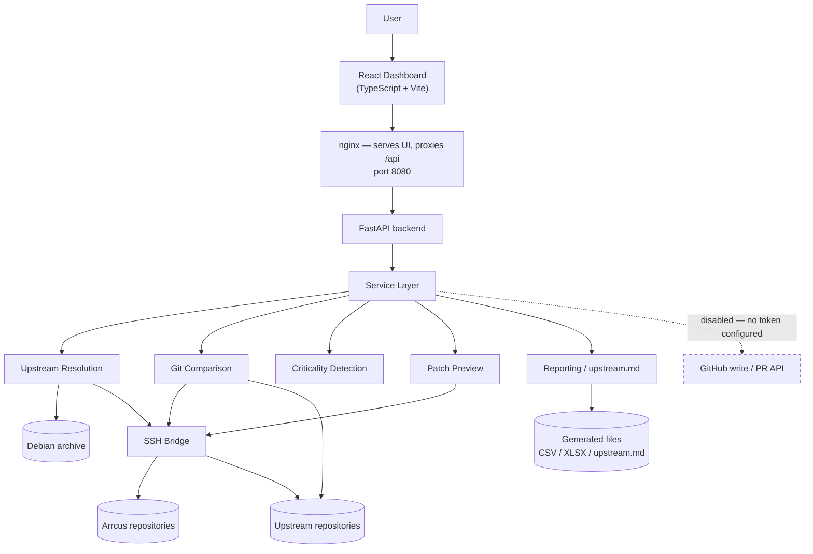
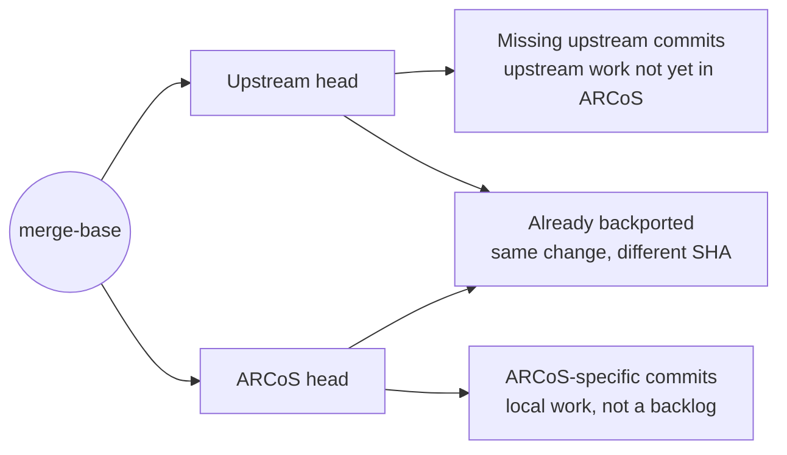

# ARCoS Package Manager

**Author:** Somil Rathore
**Repository:** `arcos-package-manager`
**Status:** Deployed on the project VM in read-only mode
**Last updated:** TBD

---

## End Goal

ARCoS ships a large set of Debian-derived packages, each maintained as an Arrcus
fork of some upstream project. Over time those forks drift, and it becomes hard
to answer three questions with any confidence: how far behind upstream a package
actually is, which of the missing commits genuinely matter, and how to pull a
selected set of them in without breaking anything.

By the end of the internship, the ARCoS Package Manager should answer all three
from evidence — Debian archive metadata and the Git commit graph — rather than
from version strings or assumption.

The complete user journey the system supports:

```
ARCoS package
  → identify Debian source package and version
  → determine the actual upstream repository and branch
  → verify that relationship against Git history
  → determine how far ARCoS is behind
  → identify important / critical upstream commits
  → safely preview selected patches
  → eventually create reviewable upstream patch PRs
```

### Minimum Goal

A stable, **read-only** tool that takes any ARCoS package and produces a
*verified* upstream mapping, an accurate Git-based measure of how far behind it
is, an evidence-based view of which missing commits matter, and a safe preview
of applying them — accessible through a dashboard on the project VM, and
exportable as mapping reports and `debian/upstream.md`.

Live push and pull-request creation are **not** part of the minimum goal.

### Stretch Goal

Extend the same verified workflow to Trixie, and move from read-only analysis to
assisted contribution: automated `debian/upstream.md` commits, authenticated
GitHub push and PR creation, PR tracking, scheduled upstream checks, and
production hardening.

---

## Architecture Overview

A single-origin web application. A React + TypeScript frontend is served by
nginx, which proxies `/api` to a FastAPI backend. The backend reads Debian
metadata over HTTP and runs Git either locally or through an SSH bridge host
that holds access to the private Arrcus repositories.

There is **no database**. All durable state is either hand-written
configuration, generated configuration, an on-disk cache that can be deleted, or
a report that can be regenerated.

| Layer | Technology |
|---|---|
| Frontend | React + TypeScript + Vite, served by nginx |
| Backend | Python + FastAPI |
| Comparison | Git (merge-base, patch-id), no version-string logic |
| Metadata | Debian archive `Sources` index, DEP-12, `debian/watch` |
| Deployment | Docker / Docker Compose on the project VM |
| Repository access | Configurable SSH bridge |
| State | Files and caches — no database |



The dashed path is deliberate: no GitHub token is configured in the current
deployment, so every write path is disabled and the dashboard states this rather
than failing at the last step.

---

## Core Design

### 1. Upstream Resolution

Debian does not record a package's upstream in one reliable field, and ARCoS
forks are not all forks of the same kind of thing — some track the upstream
project, others track the **Debian packaging repository**, and a few were
imported from tarballs and share history with nothing.

- Candidates come from an ordered chain: curated mappings → kernel version
  mapping → DEP-12 `Repository:` → `debian/watch` → `Homepage:`.
- `Vcs-Git` is **not** automatically treated as upstream. It identifies the
  Debian *packaging* repository, and is recorded in its own field.
- Each candidate repository and ref is checked for reachability and existence
  before it is considered.
- `git merge-base` then decides which candidate actually shares history with the
  ARCoS fork — including the packaging repository as a legitimate candidate.
- The result is reported as `VERIFIED`, `NEEDS_REVIEW` or `NO_UPSTREAM`, with
  the supporting evidence attached. A package with no shared history is reported
  as unresolved, never given a plausible-looking answer.
- Manual resolution goes through identical verification; a user-supplied
  repository is not exempt from proof.

> **Key principle: metadata proposes an upstream; Git history verifies it.**

A confident but wrong upstream produces a diff that looks authoritative and
means nothing — which is worse than reporting nothing at all.

### 2. Git Comparison

Version strings are never used to measure how far behind a package is. A Debian
version says what the packaging claims, not what the branch contains; two forks
at the same version can differ by hundreds of commits.



- The merge-base between the ARCoS branch and the verified upstream ref anchors
  every number reported.
- The three sets are kept strictly apart. Counting ARCoS-specific commits as
  missing upstream work would report finished work as outstanding backlog — the
  most misleading thing the tool could say.
- Merge commits are excluded throughout, since a merge cannot be cherry-picked;
  counting them would report a backlog larger than the set of patches the tool
  can actually offer.
- **Backport detection uses `git patch-id`**, which hashes the diff rather than
  the commit. A backport is the same change committed again, so its SHA is
  necessarily different; comparing SHAs would report it as missing and invite
  someone to apply it twice. Subject-line matching is deliberately not used — it
  breaks on reworded backports and falsely matches unrelated commits.
- When a package shares no commit with any upstream candidate, the comparison
  refuses and says so explicitly instead of producing a number. A backlog
  computed across unrelated histories is a fiction, not an approximation.
- Where backport detection cannot run within configured limits, it reports
  itself unavailable rather than reporting zero backports.

### 3. Critical Commit Detection

Criticality is assigned from evidence carried in the commit itself, never from
how its subject line reads.

| Evidence | Classification |
|---|---|
| CVE identifier or named security advisory | `CRITICAL` |
| `Cc: stable` trailer | `STABLE_RELEVANT` |
| `Fixes:` trailer | `NORMAL` |
| None of the above | `UNKNOWN` |

> **`UNKNOWN` means insufficient evidence — not safe.**

The matched evidence is shown alongside each classification, so a reviewer can
check the tool's reasoning rather than trust it.

### 4. Safe Patch Workflow

```
select commits → preview in a temporary workspace → detect conflicts
  → if clean, create a new branch → optionally push → eventually open a PR
```

Each step is an explicit act; nothing advances on its own.

- Preview runs in a **temporary workspace that is destroyed afterwards**. The
  target branch is never modified, so a preview is safe to run against anything.
- Commits are applied oldest-first in topological order, so a patch is never
  applied before the commit it builds on.
- A conflict stops the series, reports the conflicting paths, and aborts.
  Conflicts are **never** resolved automatically and there is no force option —
  choosing a side of a conflict is a product decision.
- Cherry-picking always creates a **new** branch; a request whose branch name
  equals the target is refused.
- Push and PR creation are separate, explicit operations requiring a GitHub
  token. **The current deployment has no token configured and is read-only.**
- Commits already present — ARCoS-specific or already backported — cannot be
  selected at all.

### 5. Single Source of Truth

There is exactly one verified Resolution per (package, release). Everything else
is a rendering of it:

```
Resolution → Dashboard
           → Excel / CSV mapping report
           → debian/upstream.md
```

Because none of these holds its own copy of the mapping, the dashboard, the
reports and the generated documentation cannot disagree. A second,
hand-maintained mapping is exactly what this structure exists to prevent.

`debian/upstream.md` is generated deterministically, so it can be compared
against what a package repository already holds and classified as created,
updated, unchanged or conflicting. A file the tool did not write is never
overwritten.

### 6. Deployment and Access Model

- The application runs on the project VM under Docker Compose. Only the frontend
  publishes a port (8080); the backend is reached through it, so there is one
  origin and no CORS configuration.
- Private Arrcus repositories are reached through a **configurable SSH bridge**:
  the VM itself needs no repository credentials, only a route to a host that has
  them. Which repositories require the bridge is a configurable list of
  patterns.
- The application code hard-codes **no** VM hostname, username, SSH key path,
  organisation or GitHub token. All of it is environment configuration, and
  secrets are never committed or logged.
- The current deployment is **read-only**. Reading private repositories works
  over SSH without a GitHub token; only the REST API needs one, so the mapping,
  comparison, reporting and preview workflows all function fully without it.

---

## Project Milestones

### Phase 0: Package Discovery and Baseline

- Discover the ARCoS package set at runtime from the release manifest, rather
  than from a hard-coded list.
- Support Bookworm on the `aminor` branch.
- Capture Debian source package, version and packaging repository per package.
- Generate the initial mapping report.

**Status: In Progress** — discovery and the mapping pipeline run end to end;
remaining packages in `NEEDS_REVIEW` are being driven to a final answer via
curated overrides.

### Phase 1: Verified Upstream Resolution

- Resolve the Debian source package and version for each package.
- Identify the Debian packaging repository separately from upstream.
- Discover candidate upstream repositories and branches through the ordered
  chain.
- Verify repository reachability, ref existence and Git ancestry.
- Record the supporting evidence for every mapping.

**Status: Completed.**

### Phase 2: Git Comparison and Commit Classification

- Calculate the merge-base between the ARCoS branch and the verified upstream
  ref.
- Identify upstream commits missing from ARCoS.
- Separate ARCoS-specific commits from the backlog.
- Detect already-backported commits using patch-id.
- Handle packages with no common ancestor explicitly rather than numerically.

**Status: Completed.**

### Phase 3: Critical Commit Identification

- Detect security and CVE-related commits.
- Detect stable-relevant commits from `Cc: stable`.
- Detect `Fixes:` commits.
- Report `UNKNOWN` wherever the evidence is insufficient.

**Status: Completed.**

### Phase 4: Dashboard

- Package, release and branch selection, with automatic or manual upstream
  resolution.
- Display the verified upstream mapping and the evidence behind it.
- Display missing, ARCoS-specific and already-backported commits separately.
- Display criticality with its evidence, and support safe patch preview.

**Status: Completed.**

### Phase 5: Reports and `upstream.md`

- Generate Excel and CSV mapping reports.
- Generate deterministic `debian/upstream.md` per package.
- Ensure reports, dashboard and generated files all derive from the same
  verified mapping.
- Produce a dry-run plan showing what would change in each package repository.

**Status: Completed** — generation and dry-run planning are in place; committing
the files to package repositories is a stretch goal (Stretch 2).

### Phase 6: VM Deployment and Validation

- Dockerize the backend and frontend.
- Deploy to the project VM under Docker Compose.
- Configure SSH bridge access entirely through environment configuration.
- Validate package discovery and comparison from the browser.
- Keep the deployment read-only.

**Status: Completed.**

### Phase 7: Testing and Stabilization

- Backend unit and integration tests, including integration tests that build
  **real temporary Git repositories** — a mocked Git would only confirm what the
  code already believes.
- Frontend tests covering API interaction and error handling.
- Automated invariant checks against the generated mapping reports.
- Document the deployment and operational workflows.

**Status: In Progress** — the backend and frontend suites and the operational
docs exist; remaining work is closing coverage gaps on the newer services and
finishing the operational runbook.

---

## Minimum / Committed Goal

The minimum internship goal is a stable, read-only ARCoS Package Manager that
can:

1. Discover the ARCoS package set for a release.
2. Resolve and **verify** each package's actual upstream repository and branch.
3. Calculate Git-based upstream lag from the commit graph.
4. Identify missing and already-backported commits, kept separate from
   ARCoS-specific work.
5. Identify critical commits from explicit evidence.
6. Present all of this through a dashboard.
7. Generate mapping reports and deterministic `debian/upstream.md`.
8. Safely preview selected patches and detect conflicts.
9. Run reliably on the project VM.

Live push and pull-request creation are **not** committed, and are not required
for this goal to be met.

---

## Stretch Goals

**Stretch 1: Trixie Support** — extend the same verified workflow to Trixie
using its own package manifest, which genuinely differs from Bookworm's. *Not
yet completed.*

**Stretch 2: Automated `upstream.md` Commit Workflow** — create branches and
commits for the generated `debian/upstream.md` files, driven from the existing
dry-run plan.

**Stretch 3: GitHub Integration** — enable authenticated push and pull-request
creation, with a PR body carrying the upstream mapping, merge base and the
evidence behind every applied commit.

**Stretch 4: PR Tracking** — surface created pull requests and their state in
the dashboard, per package.

**Stretch 5: Scheduled Upstream Checks** — periodically refresh mappings and
comparisons, and report newly missing or newly critical commits.

**Stretch 6: CI/CD and Production Hardening** — automated tests and image
builds, workspace cleanup policy, structured logging and metrics, and stricter
SSH host-key handling.

---

## Key Design Decisions

1. **Git ancestry, not metadata or version numbers, determines the upstream
   relationship.** Nothing in Debian metadata distinguishes a fork of the
   project from a fork of the packaging repository, so it is measured.
2. **`Vcs-Git` is treated as the Debian packaging repository, not automatically
   as upstream.** Treating it as upstream would silently produce the wrong
   comparison for every package that tracks the project directly.
3. **The Git commit graph determines how far behind ARCoS is.** A version string
   says what the packaging claims, not what the branch contains.
4. **ARCoS-specific commits are reported separately and never counted as
   backlog.** Otherwise finished work is reported as work still to do.
5. **Patch-id detects already-backported changes.** A backport necessarily has a
   different SHA; matching on SHA or subject line would report it as missing.
6. **Criticality requires explicit evidence, and `UNKNOWN` is a real answer.** A
   commit called critical on a hunch teaches reviewers to distrust the tool.
7. **Preview runs in a temporary workspace and never modifies the target
   branch.** The safety property is structural rather than procedural.
8. **One verified mapping is the source of truth** for the dashboard, the
   reports and `debian/upstream.md`, so they cannot disagree.
9. **Read-only is the default.** Push and PR creation require an explicitly
   configured token and an explicit user action, so a misconfiguration cannot
   escalate into an unintended repository change.

---

## Risks and Open Questions

- **Is Trixie support expected within the internship**, or is a complete and
  verified Bookworm result sufficient?
- **When should GitHub write access be enabled**, and against which
  organisation scope? This gates Stretch 2 through 4.
- **Which packages should be prioritised** for resolving the remaining
  `NEEDS_REVIEW` mappings?
- **Who are the expected users of the dashboard** beyond the immediate team?
  This determines how much production hardening is actually needed.
- Operational risks already handled and worth noting: the SSH bridge is a single
  point of dependency for all Git operations; the first comparison of a very
  large package such as the kernel is slow because it clones real history, after
  which the workspace is reused; and packages imported from tarballs have no
  common ancestor and are reported as such rather than approximated.

---

*Detailed technical documentation — resolution chain, comparison internals,
patch workflow and deployment — is maintained separately in the repository's
`docs/` directory.*
